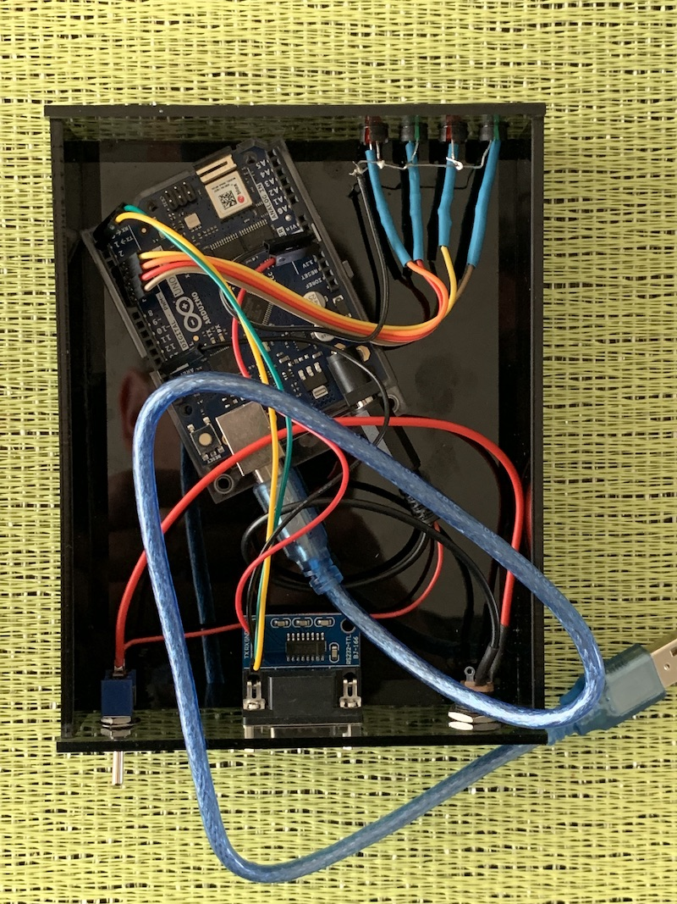
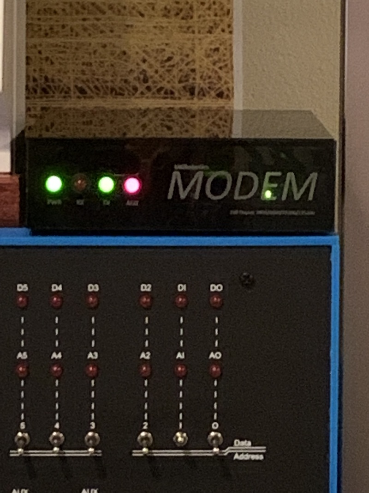

# fMODEM
This repo contains the source code for an Arduino-based "fake modem" that can connect older RS232-only computers to the internet. It runs on an Arduino UNO WiFi Rev 2 connected to a cheap MAX3232-based TTL-to-RS232 Serial port card on its TX/RX pins.

Using the fMODEM connected to a RS232 port - and running an app such as KERMIT under CP/M - allows vintage computers (or their modern recreations) to experience the horror of the modern internet like the rest of us.

## Configure WiFi:
  * AT ssid=Your WiFI Name e.g. AT ssid=MYHOTSPOT
  * AT password=Your Wifi password e.g. AT passowrd=SecretPW
  * AT SAVE
  
## Connect to WiFi:
  * AT WIFI (Once you have done an AT SAVE it will store details in EEPROM and use them next power up)

## Connect to server:
  * AT TELNET=telnet.server.address e.g. AT TELNET=towel.blinkenlights.nl
  
## Other commands
  * AT LOGOUT to cancel connection
  * AT DROP to drop WiFi connection
  * AT LIST to list available access points

# Telnet servers to try

* towel.blinkenlights.nl
* FreeChess.org

And more at http://mewbies.com/acute_terminal_fun_telnet_public_servers_watch_star_wars_play_games_etc.htm

# Issues

* Currently I've found that the WiFi connection is not working when a DC power supply is connected directly to the Arduino, rather than the USB connection. This could be nothing more than using the wrong spec power supply on my part.

* After starting work on this project, I found other solutions such as [Bo Zimmerman's](https://github.com/bozimmerman/Zimodem) Zimodem, which is a decidedly more comprehensive solution. As it one runs on the ESP8266/ESP, it can be built on a single circuit board as with [8-Bit Bruno's](https://github.com/8bit-bruno/WiFiModem) WiFiModem, my project really makes sense only if you have an Arduno UNO WiFi Rev2 lying around, or just want to do things in a different way.
